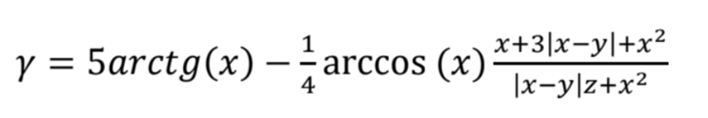
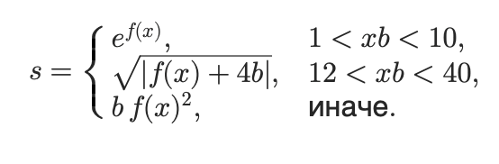
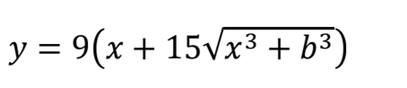

# Практическая работа №4. Тестирование "Белым ящиком" (Часть 1)

**Дисциплина:** Поддержка и тестирование программных модулей
**Цель работы:** Приобрести практические навыки ручного тестирования методом "белого ящика".

## Разработчик
* **Студент:** Прокофьев Матвей
* **Группа:** 1ИСИП-123

## Вариант задания №7

### Задание 1: Линейный алгоритм
Вычисление функции:

*Формула включает: arctg, arccos, модуль.*

### Задание 2: Разветвляющийся алгоритм
Вычисление функции $s$ с выбором $f(x)$:

*Условия зависят от произведения x * b.*

### Задание 3: Циклический алгоритм и графики
Построение графика функции:

*Цикл от x0 до xk с шагом dx.*

## Стек технологий
* **Язык:** C#
* **Платформа:** WPF (.NET Framework)
* **Библиотеки:** * `System.Windows.Forms.DataVisualization` (для построения графиков Chart)
    * `WindowsFormsIntegration` (для вставки WinForms элементов в WPF)
* **СКВ:** Git

## Архитектура приложения
Приложение реализовано на основе паттерна **Page-Based Navigation**:
1. **MainWindow:** Главное окно, содержащее `Frame` для навигации и боковую панель управления.
2. **Page1:** Страница для расчета линейной функции.
3. **Page2:** Страница с использованием переключателей `RadioButton` для выбора функции $f(x)$ и расчетом условий.
4. **Page3:** Страница с циклом `for`, выводом значений в многострочный `TextBox` и отрисовкой графика в элементе `Chart`.

## Особенности реализации
* Реализована проверка входных данных (`double.TryParse`).
* Добавлены всплывающие подсказки (`ToolTip`) для всех кнопок и полей ввода.
* Поля вывода заблокированы для редактирования (`IsReadOnly="True"`).
* Настроен выход из приложения с подтверждением через `MessageBox`.
