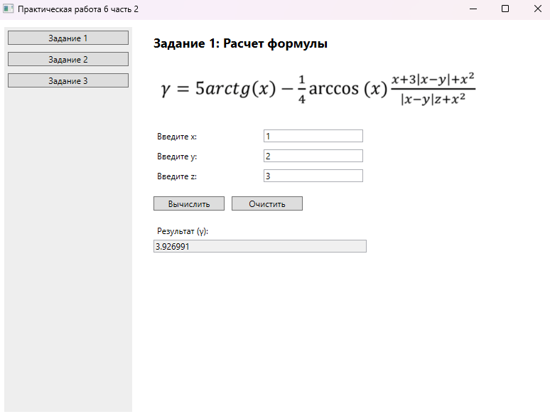
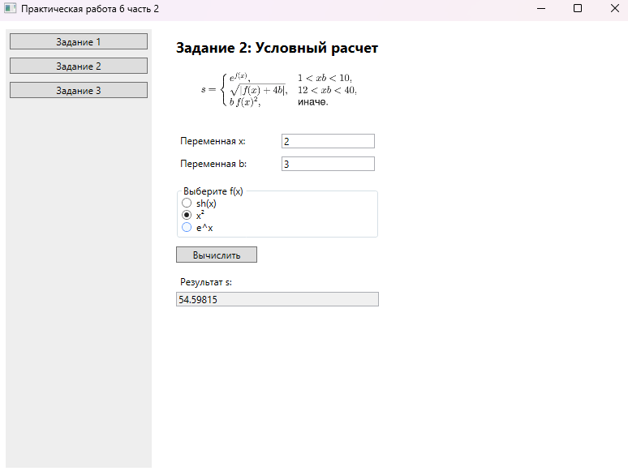
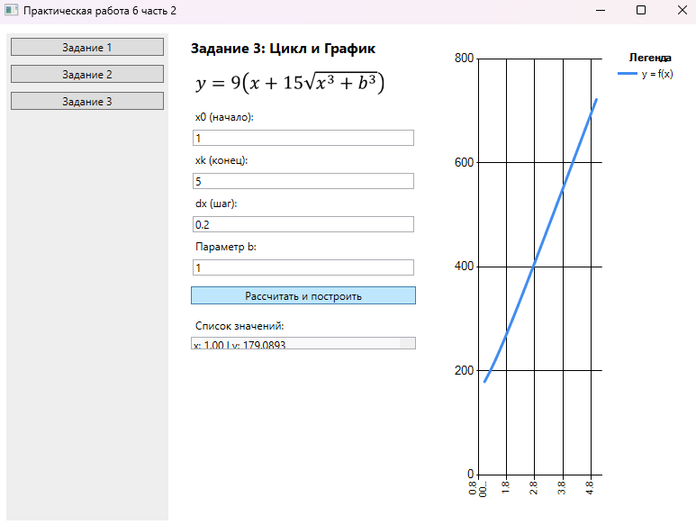
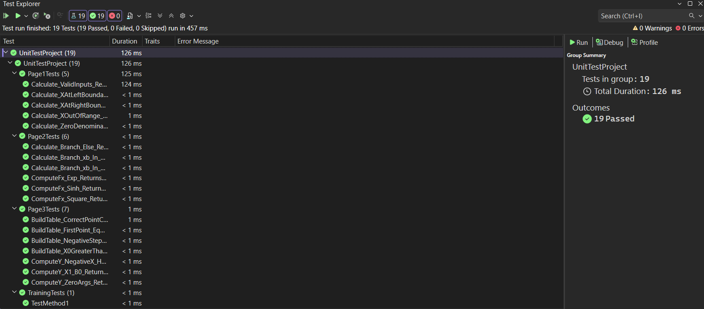

# Практическая работа 6 часть 2 — Создание автоматизированных UNIT-тестов

## Разработчик
* **Студент:** Прокофьев Матвей
* **Группа:** 3ИСИП-123

## Описание
Проект демонстрирует автоматизированное тестирование методом «белого ящика»
трёх математических функций WPF-приложения (ПР4 часть 1).

## Результаты работы приложения

### Страница 1

### Страница 2

### Страница 3

## Обозреватель тестов

## Вывод о тестировании
Было разработано **19 автоматизированных unit-тестов** для трёх
математических функций (Page1, Page2, Page3).

Все тесты завершились **успешно** по следующим причинам:

- **Page1:** Вынос математики в статический метод `Calculate()`.
  Тесты проверяют корректные значения, оба граничных случая ОДЗ (x = ±1),
  нулевой знаменатель (исключение) и выход x за диапазон (исключение).

- **Page2:** Метод `Calculate()` охватывает все три ветки условия
  (xb ∈ (1,10), xb ∈ (12,40) и ветку «иначе»), а вспомогательный
  `ComputeFx()` тестируется независимо для каждого из трёх типов функций.

- **Page3:** Метод `BuildTable()` корректно выбрасывает `ArgumentException`
  при отрицательном шаге, возвращает правильное количество точек и
  пустой список при x0 > xk. `ComputeY()` проверен на нуле, положительном
  и отрицательном аргументе (кубический корень из отрицательного числа).

## Рефакторинг

- Математическая логика отделена от UI-кода и вынесена в `public static`-методы.
- Вместо `MessageBox.Show()` в логике — выбрасываются исключения.
- Добавлены XML-документирующие комментарии (`/// 
`).
- В Page2 введён `enum FunctionType` для явного указания типа функции.
- В Page3 введена структура `DataPoint` для представления точки таблицы.
